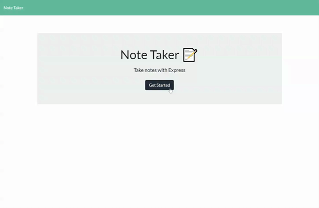

# Note-Taker
Web application called Note Taker that can be used to write and save notes. Using this application you can organize your thoughts and keep track of tasks you need to complete.

This application will use an [Express.js](https://expressjs.com/) back end and will save and retrieve note data from a JSON file.

---

## Table of Contents

- [Installation](#installation)
- [Deployed Link](#deployed-link)
- [Preview](#preview)
- [License](#license)
- [Questions](#questions)

---
## Installation

- Clone this repository to your local development environment.
```
git clone https://github.com/ryanhadfield/Note-Taker
```
- Navigate to the developer-profile-generator folder using the command prompt.
- Run `npm install` to install all dependencies. To use the application locally, run node server.js in your CLI, and then open http://localhost:8080 in your preferred browser. 

---

## Deployed Link
- The Note Taker app is live on Heroku [here](https://ryans-notes.herokuapp.com/).

---

## Preview


---

## License

MIT License

Copyright (c) 2021 Ryan Hadfield

Permission is hereby granted, free of charge, to any person obtaining a copy
of this software and associated documentation files (the "Software"), to deal
in the Software without restriction, including without limitation the rights
to use, copy, modify, merge, publish, distribute, sublicense, and/or sell
copies of the Software, and to permit persons to whom the Software is
furnished to do so, subject to the following conditions:

The above copyright notice and this permission notice shall be included in all
copies or substantial portions of the Software.

THE SOFTWARE IS PROVIDED "AS IS", WITHOUT WARRANTY OF ANY KIND, EXPRESS OR
IMPLIED, INCLUDING BUT NOT LIMITED TO THE WARRANTIES OF MERCHANTABILITY,
FITNESS FOR A PARTICULAR PURPOSE AND NONINFRINGEMENT. IN NO EVENT SHALL THE
AUTHORS OR COPYRIGHT HOLDERS BE LIABLE FOR ANY CLAIM, DAMAGES OR OTHER
LIABILITY, WHETHER IN AN ACTION OF CONTRACT, TORT OR OTHERWISE, ARISING FROM,
OUT OF OR IN CONNECTION WITH THE SOFTWARE OR THE USE OR OTHER DEALINGS IN THE
SOFTWARE. [](https://opensource.org/licenses/MIT)

---

## Badges


---

## Questions

Github: https://github.com/ryanhadfield

Email: Ryan.Hadfield@gmail.com
